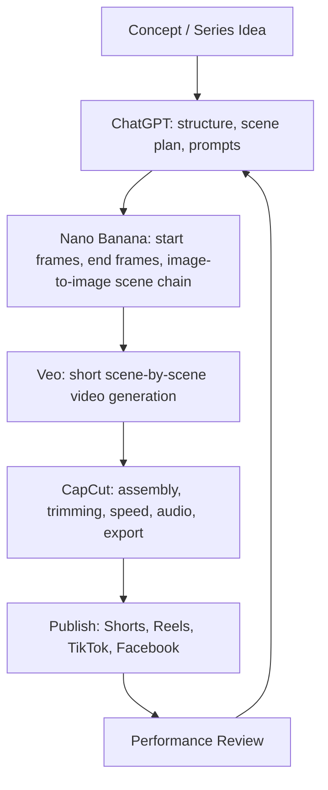

# AI Construction Video Production Stack

## Summary

The production stack is intentionally simple and controlled. Each tool has a specific job: ChatGPT plans the system, Nano Banana creates consistent images, Veo turns image pairs into motion, and CapCut assembles the final retention-focused video.

The workflow is image-first. Do not rely on video generation to invent the construction logic.

## Workflow Diagram

## Rules

### ChatGPT

| Field | Description |
|---|---|
| Purpose | Architecture, not final creation |
| Inputs | Concept, target structure, location, materials, desired reveal, previous scene state |
| Outputs | Scene breakdown, image prompts, video prompts, regeneration fixes, editing plan |
| Best Practices | Ask for physical sequence, start/end frame logic, continuity constraints, and negative constraints |

Use ChatGPT to make the build believable before generating anything. A weak prompt chain creates weak images and weaker videos.

### Nano Banana

| Field | Description |
|---|---|
| Purpose | Image generation and image-to-image modification |
| Inputs | Base frame prompt, previous image, specific edit instruction |
| Outputs | Consistent start frames and end frames for each scene |
| Best Practices | Keep camera, framing, environment, lighting, scale, and object placement stable |

Nano Banana is the structural foundation. Each generated image should be a usable production frame, not just a pretty concept image.

### Veo

| Field | Description |
|---|---|
| Purpose | Convert start frame and end frame pairs into realistic motion |
| Inputs | Start image, end image, specific physical action prompt |
| Outputs | Short construction clips, usually one scene per clip |
| Best Practices | Use one worker, static camera, fast timelapse, real workflow, ASMR material handling, no cuts |

Veo should simulate the process between two controlled states. Do not ask it to solve the whole video at once.

### CapCut

| Field | Description |
|---|---|
| Purpose | Final assembly and pacing |
| Inputs | Generated video clips, optional audio, final reveal clip |
| Outputs | Export-ready vertical video |
| Best Practices | Trim dead frames, speed up weak sections, keep chronological order, avoid heavy transitions |

CapCut is where the video becomes retention-optimized. The edit should be clean and process-focused.

## Checklist

- [ ] Is the concept planned before image generation?
- [ ] Are all major scenes generated as still frames first?
- [ ] Does every video clip have a start frame and end frame?
- [ ] Is the same worker described across video prompts?
- [ ] Are clips assembled in logical construction order?
- [ ] Is the final export vertical and platform-ready?

## Examples

### Complete Stack Example

1. ChatGPT creates a 12-step scene plan for an underground bunker build.
2. Nano Banana generates an empty snowfield, marked rectangle, shallow pit, deep pit, covered hatch, and interior build stages.
3. Veo generates short clips between each pair of adjacent frames.
4. CapCut trims each clip to the strongest visible action and assembles a 35-45 second final video.

## Reusable Framework

For every episode, use this production stack:

1. Concept: define the hidden transformation.
2. ChatGPT: create the physical step sequence.
3. Nano Banana: build the full visual chain with image-to-image edits.
4. Veo: generate one controlled motion clip per scene transition.
5. CapCut: assemble, trim, speed up, and export.
6. Publish: distribute the same video across short-form platforms.

